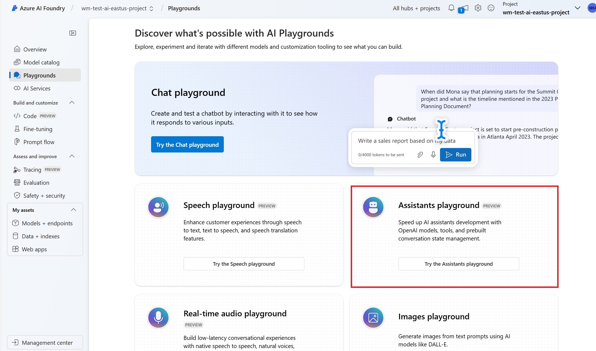
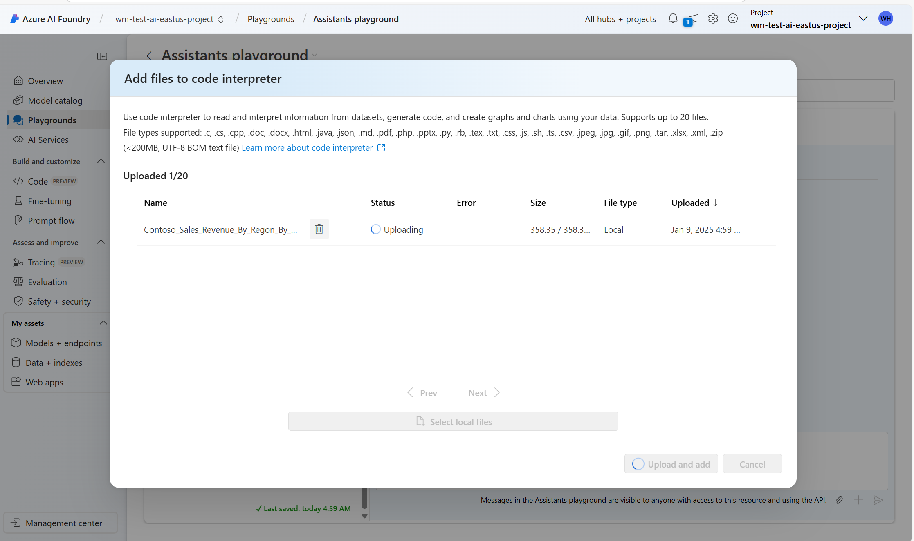

# Azure AI Foundry Assitant API

#### Description
In this lab you are going to show the Azure OpenAI Assistant API capabilities using the playground in Azure AI Foundry with GPT-4o Model deployed.
The lab is intended to leave the audience inspired to learn more about what they can build with LLMs.

#### Required access and products
- Azure AI Foundry

- Model GPT-4o or GPT-4o-Mini deployed

## Lab flow
- [Backup video recording](https://aka.ms/AArvvsd)

### Setup the assistant:


#### Instructions


1. Go to the Azure AI Foundry portal and access the Assistants playground
    

2. Add this to the instructions field
    ```
    You are a sales analysis assistant for Contoso. Please be polite, professional, helpful, and friendly.

    You get all the sales data from the uploaded csv files. There is sales revenue data that is broken down region, product category, product type and split out by year and month.

    Examples of regions include Africa, Asia, Europe and America. Categories include climbing gear, camping equipment, apparel and more. Product categories include jackets, hammocks, wet suites, crampons, shows and more.

    If a question is not related to sales or you cannot answer the question, say, 'contact IT for more assistance.'. If the user asks for help or says 'help', provide a list of sample questions that you can answer.
    ```

#### Tools
- Enable Code Interpreter 
- Click add files behind Code Interpreter and upload [the sales data csv file](/lab/02_assistant_api/Contoso_Sales_Revenue_By_Regon_By_Category_By_Product_Type_By_Year_Month.csv).




### Questions 
You can for example ask the questions below:
```
Help
```
```
What is the total sales revenue for Europe product category
```
```
Put that in a graph
```
```
Best sold product
```
