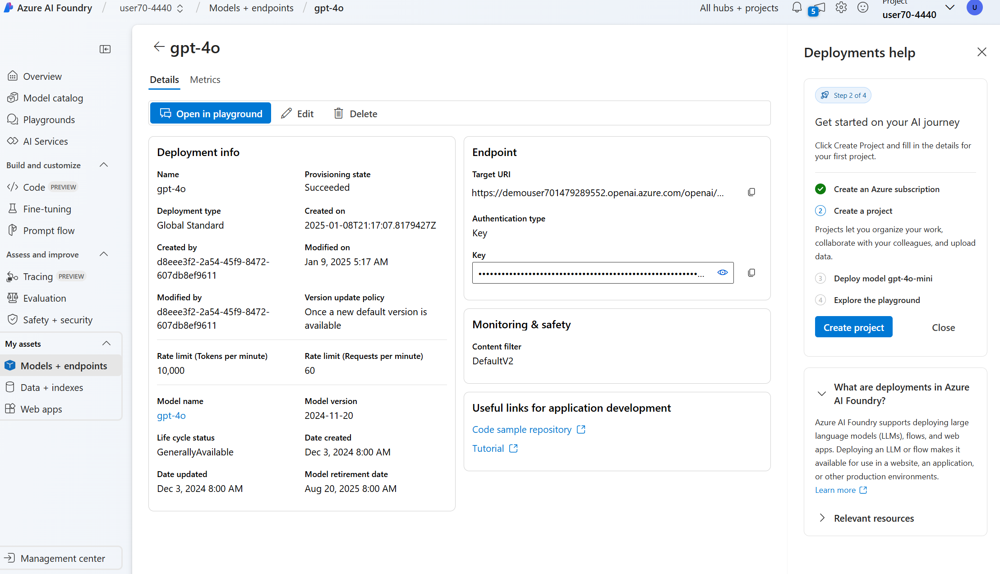

# Contoso Sales Analysis Assistant

## Programming Languages

- Python

## Deploy Azure AI Foundry Resources

- Create Azure AI Foundry Hub and Project in Azure AI Foundry.
- Create deployment for GPT-4o models and get the key and endpoint to use in the code. Find more details in [setup.md](setup.md)
- Rename or copy the **.env.sample** file to **.env**
- Add the deployment key, endpoint, and deployment to the .env file

    ```text
    OPENAI_URI=
    OPENAI_KEY=
    OPENAI_VERSION=2024-05-01-preview
    MODEL_DEPLOYMENT_NAME=
    PROJECT_CONNECTION_STRING=
    BING_CONNECTION_NAME=
    ```
    

## References

1. Learn how to create an Azure AI Foundry Project and connect it to an Azure OpenAI resource [here](https://learn.microsoft.com/azure/ai-studio/how-to/create-projects?tabs=ai-studio).
1. Then go through this [quickstart](https://learn.microsoft.com/azure/ai-studio/quickstarts/get-started-playground#deploy-a-chat-model) to create a gpt-4o model deployment.


and select the subscription that has been allowlisted for the service private preview.

## Running the labs

You can run the labs in a Codespace or locally in a dev container or a Python virtual environment. It's recommended to run the labs in a Codespace, but choose the option that works best for you.

### Codespaces

Open the repo [Azure AI CSP Boost Up Camp](https://github.com/mshk-gps-partner-technical/2025-csp-azure-ai-boostup-camp) in a Codespace and run the labs in the Jupyter Notebooks in your browser.

### Local installation

#### Install with Dev Containers

The labs can be run in a Dev Container in Visual Studio Code.

1. Install Visual Studio Code
1. Install the Remote - Containers extension
1. Install Docker
1. Open the repo in Visual Studio Code and click the "Reopen in Container" button

#### Install on the Local Machine

Create a Python Virtual Environment

##### Windows

1. Create a new Python virtual environment by running the following command in your terminal:

    ```bash
    python -m venv .venv
    ```

2. Activate the virtual environment:

    ```bash
    .venv\Scripts\activate
    ```

##### macOS and Linux

1. Create a new Python virtual environment by running the following command in your terminal:

    ```bash
    python3 -m venv .venv
    ```

2. Activate the virtual environment:

    ```bash
    source .venv/bin/activate
    ```

##### Update pip

```bash
pip install --upgrade pip
```

##### Pip install required libraries

```bash
pip install -r requirements.txt
```
